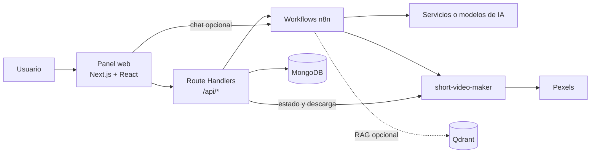

# Social Content Studio

Plataforma web para crear, evaluar y organizar contenido para redes sociales mediante automatizaciones de inteligencia artificial. Desde un único panel permite generar guiones, propuestas visuales y videos cortos, analizar el sentimiento de un texto y consultar el historial de resultados.

La aplicación está construida con Next.js y delega el procesamiento de IA a workflows de n8n. MongoDB conserva el historial, mientras que `short-video-maker` se ocupa de la composición y entrega de videos.

## Contenido

- [Funcionalidades](#funcionalidades)
- [Arquitectura](#arquitectura)
- [Tecnologías](#tecnologías)
- [Requisitos](#requisitos)
- [Configuración](#configuración)
- [Instalación y ejecución](#instalación-y-ejecución)
- [Uso](#uso)
- [Integración con n8n](#integración-con-n8n)
- [API](#api)
- [Estructura del proyecto](#estructura-del-proyecto)
- [Operación y resolución de problemas](#operación-y-resolución-de-problemas)

## Funcionalidades

- **Generación de guiones:** crea propuestas con gancho, cuerpo y llamado a la acción en tono profesional, inspirador, cercano, divertido o corporativo.
- **Generación de imágenes:** transforma una descripción y uno o más objetivos de comunicación en una propuesta visual o una imagen generada.
- **Generación de videos cortos:** combina escenas, narración, subtítulos, música y videos de fondo obtenidos mediante Pexels. Admite orientación vertical y horizontal.
- **Análisis de sentimiento:** clasifica el tono de un texto y presenta la justificación y los atributos adicionales devueltos por la automatización.
- **Historial persistente:** guarda en MongoDB las solicitudes completadas y muestra hasta 50 resultados recientes, paginados de a 5 en la interfaz.
- **Asistente conversacional:** integra de forma opcional un widget de n8n Chat para brindar asistencia creativa contextual.

## Arquitectura



### Flujo general

1. El usuario completa un formulario en el panel.
2. La interfaz invoca un endpoint interno de Next.js.
3. El endpoint valida el payload con Zod, construye el prompt y llama al webhook configurado en n8n.
4. La integración acepta respuestas inmediatas o procesos asíncronos con `taskId` y polling.
5. El resultado se normaliza y se guarda en MongoDB.
6. La API devuelve el elemento persistido para actualizar la interfaz y el historial.

### Flujo de video

Para los videos, n8n debe iniciar la generación en `short-video-maker` y devolver un `videoId`. Si el video continúa en proceso, el navegador consulta su estado cada 5 segundos durante un máximo de 5 minutos. Cuando está listo, la aplicación actualiza el registro y utiliza un endpoint proxy para reproducir o descargar el archivo MP4.

> n8n no forma parte de `docker-compose.yml`: debe existir una instancia accesible y sus workflows deben configurarse por separado. Qdrant se incluye como infraestructura para escenarios de RAG, pero el código de Next.js no lo consulta directamente.

## Tecnologías

| Componente | Tecnología |
| --- | --- |
| Aplicación web y API | Next.js 16, React 19, TypeScript |
| Validación | Zod |
| Persistencia | MongoDB 6, Mongoose |
| Automatización | n8n y `@n8n/chat` |
| Generación de video | `gyoridavid/short-video-maker` |
| Base vectorial opcional | Qdrant |
| Infraestructura local | Docker Compose |

## Requisitos

- Node.js **20.9 o superior**, requerido por Next.js 16.
- npm, incluido con Node.js.
- Docker Engine con Docker Compose v2.
- Una instancia de n8n accesible desde la aplicación.
- Una clave de Pexels para generar videos con material de fondo.
- Al menos 4 GB de memoria disponibles para el contenedor de video; la composición actual también le asigna 2 CPU.

## Configuración

La configuración se divide en dos archivos porque Docker Compose y Next.js los cargan desde ubicaciones diferentes.

### 1. Variables de infraestructura

Crea un archivo `.env` en la raíz del repositorio:

```dotenv
PEXELS_API_KEY=tu_clave_de_pexels
```

Docker Compose inyecta esta clave en `short-video-maker`. No es necesaria para MongoDB ni Qdrant, pero sí para buscar los videos de fondo utilizados en cada escena.

### 2. Variables de la aplicación

Crea `frontend/.env.local` con la siguiente configuración:

```dotenv
# Webhook principal de contenidos
N8N_WEBHOOK_URL=https://n8n.example.com/webhook/content-studio

# Persistencia
MONGODB_URI=mongodb://localhost:27017/content_studio
MONGODB_DB=content_studio

# Servicio de video
SHORT_VIDEO_MAKER_URL=http://localhost:3123

# Polling de tareas asíncronas de n8n
N8N_POLL_INTERVAL_MS=3000
N8N_POLL_TIMEOUT_MS=60000

# Widget de chat opcional
NEXT_PUBLIC_N8N_CHAT_WEBHOOK=https://n8n.example.com/webhook/chat
NEXT_PUBLIC_CHAT_PROJECT=content-studio
```

| Variable | Obligatoria | Valor predeterminado | Descripción |
| --- | :---: | --- | --- |
| `PEXELS_API_KEY` | Para video | — | Clave utilizada por `short-video-maker`; se define en el `.env` raíz. |
| `N8N_WEBHOOK_URL` | Sí | — | Webhook que procesa guiones, imágenes, videos y sentimiento. |
| `MONGODB_URI` | Sí | — | Cadena de conexión de MongoDB. |
| `MONGODB_DB` | No | `content_studio` | Nombre de la base de datos. |
| `SHORT_VIDEO_MAKER_URL` | No | `http://localhost:3123` | URL accesible desde el servidor Next.js. |
| `N8N_POLL_INTERVAL_MS` | No | `3000` | Intervalo entre consultas a una tarea pendiente de n8n. |
| `N8N_POLL_TIMEOUT_MS` | No | `60000` | Tiempo máximo total de espera de una tarea de n8n. |
| `NEXT_PUBLIC_N8N_CHAT_WEBHOOK` | No | — | Webhook de n8n Chat. Si se omite, el widget no se renderiza. |
| `NEXT_PUBLIC_CHAT_PROJECT` | No | `content-studio` | Identificador enviado en los metadatos del chat. |

Las variables con el prefijo `NEXT_PUBLIC_` quedan expuestas al navegador. No deben contener secretos.

## Instalación y ejecución

### Desarrollo local

1. Configura los dos archivos de entorno descritos en la sección anterior.

2. Desde la raíz, inicia la infraestructura:

   ```bash
   docker compose up -d
   ```

3. Instala las dependencias del frontend usando el lockfile:

   ```bash
   cd frontend
   npm ci
   ```

4. Inicia el servidor de desarrollo:

   ```bash
   npm run dev
   ```

5. Abre [http://localhost:3000](http://localhost:3000).

Desde la raíz del repositorio, puedes comprobar el estado de los contenedores con:

```bash
docker compose ps
```

### Producción

Con las variables de entorno de producción disponibles para el proceso de Next.js:

```bash
cd frontend
npm ci
npm run build
npm run start
```

`npm run start` sirve el build en el puerto `3000` de forma predeterminada. En un despliegue remoto, `MONGODB_URI`, `N8N_WEBHOOK_URL` y `SHORT_VIDEO_MAKER_URL` deben apuntar a servicios alcanzables desde el servidor; `localhost` solo es válido si esos servicios comparten el mismo host.

## Uso

### Guiones

Selecciona **Guiones listos para publicar**, describe el tema o brief con al menos 10 caracteres, elige un tono y genera la propuesta.

### Imágenes

En **Ideas visuales**, describe la pieza y selecciona al menos un objetivo. La interfaz admite una URL, un `data URI` o contenido Base64 devuelto por n8n y muestra una vista previa cuando reconoce la imagen.

### Videos

En **Videos cortos**:

1. Agrega una o más escenas.
2. Escribe al menos 5 caracteres de narración por escena.
3. Separa los términos de búsqueda visual con comas.
4. Elige música, voz, posición de subtítulos y orientación.
5. Inicia la generación y espera a que el indicador cambie a listo.

Las voces configuradas pertenecen a Kokoro TTS. La disponibilidad de idiomas, voces y pistas depende de la imagen de `short-video-maker` utilizada.

### Sentimiento e historial

El analizador requiere un texto de al menos 10 caracteres. Todas las operaciones exitosas se incorporan al historial; el botón **Actualizar** vuelve a consultar los últimos registros de MongoDB.

### Chat

Cuando `NEXT_PUBLIC_N8N_CHAT_WEBHOOK` está definido, aparece un botón flotante en la esquina inferior derecha. El webhook debe corresponder a un workflow compatible con n8n Chat y permitir solicitudes desde el origen donde se publica el frontend.

## Integración con n8n

El webhook principal recibe solicitudes `POST` con esta forma general:

```json
{
  "type": "script | image | video | sentiment",
  "prompt": "Prompt construido por la API",
  "scenes": [],
  "config": {}
}
```

`scenes` y `config` solo se envían para videos.

### Respuesta síncrona

La forma recomendada para guiones, imágenes y sentimiento es:

```json
{
  "status": "completed",
  "result": {
    "output": "Resultado generado"
  }
}
```

La interfaz también reconoce, entre otros, los campos `text`, `summary`, `description`, `imageUrl`, `imageData`, `imageBase64`, `category`, `feelings`, `sentiment` y `score`.

### Respuesta asíncrona

n8n puede iniciar una tarea y responder:

```json
{
  "status": "pending",
  "taskId": "task-123"
}
```

La aplicación realizará solicitudes `GET` al mismo `N8N_WEBHOOK_URL` agregando `?taskId=task-123` hasta recibir `completed`, `error` o alcanzar el tiempo límite configurado.

### Respuesta de video

Para un video en curso:

```json
{
  "status": "processing",
  "videoId": "uuid-del-video"
}
```

Si el archivo ya está disponible, utiliza `"status": "ready"`. El workflow es responsable de transformar `scenes` y `config` en una llamada compatible con `short-video-maker`.

Ejemplo de payload de video:

```json
{
  "scenes": [
    {
      "text": "Presentamos una nueva forma de crear contenido.",
      "searchTerms": ["creative team", "social media"]
    }
  ],
  "config": {
    "paddingBack": 1500,
    "music": "chill",
    "voice": "af_heart",
    "captionPosition": "bottom",
    "captionBackgroundColor": "blue",
    "orientation": "portrait"
  }
}
```

## API

| Método | Ruta | Uso |
| --- | --- | --- |
| `POST` | `/api/content/script` | Genera un guion. Body: `{ "topic": string, "tone": string }`. |
| `POST` | `/api/content/image` | Genera una propuesta visual. Body: `{ "description": string, "goals": string[] }`. |
| `POST` | `/api/content/video` | Inicia un video. Body: `{ "scenes": VideoScene[], "config"?: VideoConfig }`. |
| `GET` | `/api/content/video?videoId=...` | Consulta el estado en `short-video-maker`. |
| `PATCH` | `/api/content/video` | Actualiza el estado persistido. Body: `{ "itemId": string, "videoStatus": string }`. |
| `GET` | `/api/content/video/download?videoId=...` | Devuelve el MP4 mediante un proxy. |
| `POST` | `/api/content/sentiment` | Analiza un texto. Body: `{ "text": string }`. |
| `GET` | `/api/history?limit=20` | Obtiene los registros más recientes. `limit` se restringe al rango de 1 a 50. |

Estas rutas son consumidas por la propia interfaz. Actualmente no implementan autenticación ni autorización; antes de exponer la aplicación públicamente, deben protegerse en el proxy, la plataforma de despliegue o la aplicación.

## Servicios Docker

Ejecuta los comandos de esta sección desde la raíz del repositorio.

| Servicio | Puertos | Persistencia | Propósito |
| --- | --- | --- | --- |
| `mongodb` | `27017` | `mongo_data` | Historial de contenido. |
| `qdrant` | `6333` REST, `6334` gRPC | `qdrant_data` | Almacenamiento vectorial opcional para RAG. |
| `short-video-maker` | `3123` | `video_data` | Renderizado, consulta y entrega de videos. |

Detener los servicios sin eliminar sus volúmenes:

```bash
docker compose down
```

## Estructura del proyecto

```text
.
├── docker-compose.yml
├── README.md
└── frontend/
    ├── public/
    ├── src/
    │   ├── app/
    │   │   ├── api/
    │   │   │   ├── content/
    │   │   │   │   ├── image/
    │   │   │   │   ├── script/
    │   │   │   │   ├── sentiment/
    │   │   │   │   └── video/
    │   │   │   └── history/
    │   │   ├── globals.css
    │   │   ├── layout.tsx
    │   │   └── page.tsx
    │   ├── components/
    │   │   └── ContentChatWidget.tsx
    │   ├── lib/
    │   │   ├── content-service.ts
    │   │   ├── db.ts
    │   │   └── n8n.ts
    │   ├── models/
    │   │   └── ContentItem.ts
    │   └── types/
    │       └── content.ts
    ├── package.json
    └── package-lock.json
```

## Scripts disponibles

Ejecuta estos comandos desde `frontend/`:

| Comando | Descripción |
| --- | --- |
| `npm run dev` | Inicia Next.js en modo desarrollo con recarga automática. |
| `npm run build` | Genera el build optimizado de producción. |
| `npm run start` | Sirve el build de producción. |
| `npm run lint` | Ejecuta ESLint sobre el proyecto. |

## Operación y resolución de problemas

### El historial no carga

- Desde la raíz del repositorio, comprueba que MongoDB esté activo con `docker compose ps`.
- Verifica `MONGODB_URI` y `MONGODB_DB` en `frontend/.env.local`.
- Si Next.js estaba iniciado cuando cambiaste el archivo, reinicia el servidor.

### Las generaciones devuelven error 500

- Confirma que `N8N_WEBHOOK_URL` esté definido y sea accesible desde el proceso de Next.js.
- Revisa que el workflow esté activo y que responda con un código HTTP exitoso.
- Para tareas asíncronas, asegúrate de devolver un `taskId` y aceptar el polling por `GET`.

### El video queda procesando

- Verifica la clave `PEXELS_API_KEY` y reinicia `short-video-maker` después de modificarla.
- Confirma que n8n devuelva un `videoId` válido.
- Revisa los logs con `docker compose logs short-video-maker`.
- Comprueba que el contenedor tenga memoria y CPU suficientes.
- El frontend deja de consultar después de 5 minutos, aunque el render puede continuar en segundo plano.

### El chat no aparece

- Define `NEXT_PUBLIC_N8N_CHAT_WEBHOOK` antes de compilar o iniciar Next.js.
- Reinicia el servidor después de cambiar variables `NEXT_PUBLIC_*`.
- Verifica que el workflow de n8n Chat esté activo y acepte el origen del frontend.

## Persistencia y seguridad

Los volúmenes de Docker conservan MongoDB, Qdrant y los videos al reiniciar los contenedores. Los archivos `.env*` están excluidos de Git; mantén las credenciales fuera del repositorio y utiliza un gestor de secretos en producción.

El repositorio no incluye una licencia. Salvo que se agregue una, su uso y redistribución permanecen sujetos a los derechos de sus autores.
